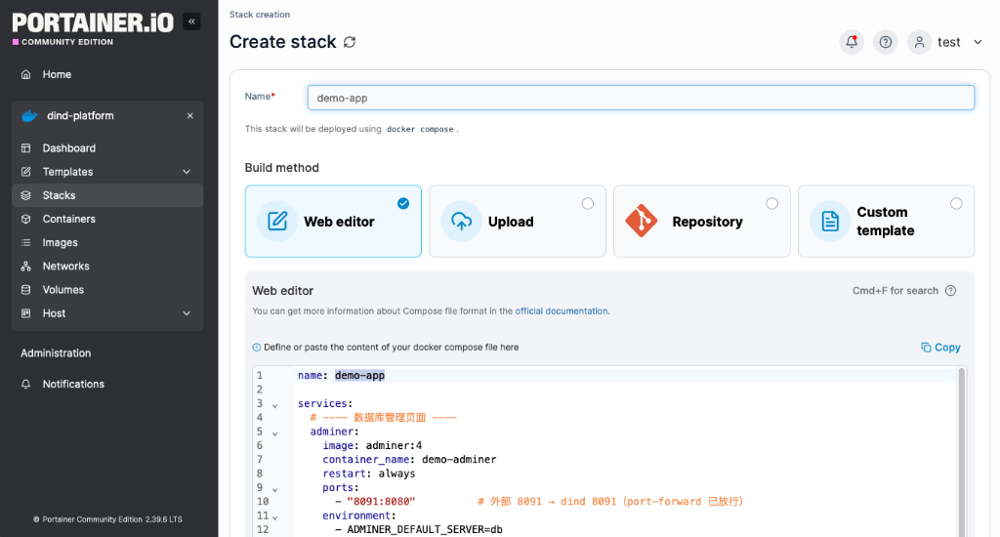

# Portainer 自助部署

**目的**：test 用户在 Portainer 中自助部署应用，全程无需管理员介入。

当前提供两个样例工程：


| 工程         | 说明                                                  | 外部入口               |
| ------------ | ----------------------------------------------------- | ---------------------- |
| demo-app     | Adminer + PostgreSQL（web + db 两层）                 | `http://10.8.0.8:8001` |
| solar-server | Express 单进程（API + 移动端 PWA + 管理后台），SQLite | `http://10.8.0.8:8002` |

## 镜像获取

- **官方镜像**：用短名即可（如 `adminer:4` / `postgres:16-alpine`），自动经内网 proxy-cache `http://10.8.0.8:6000` 缓存拉取（首次回源 Docker Hub）
- **私有镜像**：写完整地址 `10.8.0.8:5000/xxx`（insecure-registries 已信任，自助拉取）
- 带前缀镜像（如 `bitnami/xx`）mirror 不覆盖，需写完整地址 `10.8.0.8:6000/library/xx`

## 一键部署



页面操作步骤：

1. 登录 `https://10.8.0.8:9443`（test 账户）
2. 顶部环境确认选择 **dind-platform**（左栏应显示该环境）
3. 左侧 **Stacks** → 右上角 **+ Add stack**
4. Name 填对应工程名（`demo-app` / `solar-server`），Build method 选 **Web editor**
5. 将下方对应 compose 文件全部内容粘贴到编辑框
6. 滚动到底部，点 **Deploy the stack**
7. 等待 5-10 秒（首次拉取会经内网 proxy-cache 缓存秒回）

## 端口映射

外部流量链路：`10.8.0.8:<端口>` → Portainer平台 → 平台内服务。


| 端口          | 用途                             |
| ------------- | -------------------------------- |
| `8001`        | demo-app Adminer                 |
| `5433`        | demo-app PostgreSQL              |
| `8002`       | solar-server其他团队应用部署预留 |
| `8003` `8004` | 预留                             |
| `3306`        | MySQL 直连预留                   |
| `5432`        | PostgreSQL 直连预留              |

## 版本更新

```
① 开发机（solar 仓库）
   git commit / push 提交代码
   bash push-image.sh 260821      # 构建 + 打日期 tag + 推送 Registry（latest 同步更新）

② Portainer 平台（手动）
   Stacks → solar-server → Edit stack
   改新版本号 → Update the stack
```

## demo-app

### 应用说明

数据库管理页面（Adminer）+ 数据库（PostgreSQL），演示 `web + db` 两层应用，包含外部端口转发和命名卷（数据持久化）。

### 部署后访问验证


| 入口             | 地址                   | 凭据                                                                         |
| ---------------- | ---------------------- | ---------------------------------------------------------------------------- |
| Adminer 管理页面 | `http://10.8.0.8:8001` | 系统`PostgreSQL` / 服务器 `db` / 用户 `app` / 密码 `app123` / 数据库 `appdb` |
| PostgreSQL 直连  | `10.8.0.8:5433`        | 用户`app` / 密码 `app123` / 库 `appdb`                                       |

> **可选凭据自动填充**：compose 中 adminer 配置了 `ADMINER_DEFAULT_SERVER=db`，浏览器打开后"服务器"字段已预填 `db`，只需填其他字段即可登录。

### 持久化验证

1. 在 Adminer 中建一张表（如 `CREATE TABLE t (id int, name text);`），插入几行
2. 在 Portainer **Stacks** 中点 `demo-app` → **Delete the stack**（容器和默认网络被删除，命名卷 `db-data` 保留）
3. 重新执行「一键部署」步骤
4. 再次打开 Adminer，表和数据应仍然存在

### compose 文件

```yaml
name: demo-app

services:
  # ---- 数据库管理页面 ----
  adminer:
    image: adminer:4
    container_name: demo-adminer
    restart: always
    ports:
      - "8001:8080" # 外部 8001 → dind 8001（port-forward 已放行）
    environment:
      - ADMINER_DEFAULT_SERVER=db
    depends_on:
      - db
    networks:
      - demo-net

  # ---- 数据库 ----
  db:
    image: postgres:16-alpine
    container_name: demo-db
    restart: always
    environment:
      - POSTGRES_USER=app
      - POSTGRES_PASSWORD=app123
      - POSTGRES_DB=appdb
    ports:
      - "5433:5432" # 外部 5433 → dind 5433（port-forward 已放行）
    volumes:
      - db-data:/var/lib/postgresql/data
    networks:
      - demo-net

networks:
  demo-net:

volumes:
  db-data:
```

---

## solar-server

### 应用说明

单进程 Express 服务，同时托管 API（`/api/v1`）、移动端 PWA（`/`，业主 / 维修师傅共用）、管理后台（`/admin/`，管理员专用）。数据存储 SQLite（文件 `/data/solar.db`），镜像内置测试数据，首启自动拷贝到数据卷。

### 部署后访问验证


| 入口       | 地址（dind 内部）         | 说明                |
| ---------- | ------------------------- | ------------------- |
| 移动端 PWA | `http://<ip>:5001/`       | 业主 / 维修师傅共用 |
| 管理后台   | `http://<ip>:5001/admin/` | 管理员专用          |
| API 服务   | `http://<ip>:5001/api/v1` | REST API            |

测试账号：手机号 `13000000000` ~ `13000000004`，密码统一 `test123456`。

### 数据持久化

- 命名卷 `solar_data` 挂载到容器 `/data`（SQLite 文件 `/data/solar.db`）
- 首次启动自动从镜像拷贝内置测试数据；后续数据保存在卷中，**重启 / 更新不丢失**

### compose 文件

```yaml
name: solar-server

services:
  # ---- 光伏平台单进程服务（Express 托管 API + 双前端）----
  server:
    image: ${REGISTRY_HOST:-10.8.0.8:5000}/solar-server:${SOLAR_TAG:-260814}
    container_name: solar-server
    restart: always
    environment:
      - DATABASE_URL=file:/data/solar.db
      - JWT_SECRET=dev-secret-change-in-production
      - PORT=5001
      - NODE_ENV=production
      - TZ=Asia/Shanghai
    ports:
      - "8002:5001" # 外部访问需在宿主机放行 5001（当前未放行，仅 dind 内部可达）
    volumes:
      - solar_data:/data

volumes:
  solar_data:
```
